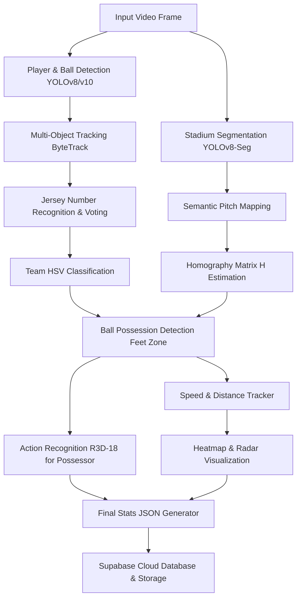

# مشروع تخرج: نظام تحليل مباريات كرة القدم بالذكاء الاصطناعي
## AI-Based Football Match Analysis System — Graduation Thesis Guide

دليل متكامل ومفصل لمحتوى كتاب مشروع التخرج الخاص بك. تم إعداد هذا الدليل بناءً على الكود الفعلي للمشروع ليغطي الجوانب النظرية، والرياضية، والعملية، والبرمجية، بحيث يمكنك نقله مباشرة إلى فصول كتاب مشروعك.

---

## 📑 هيكل كتاب التخرج المقترح (Thesis Structure)

1. **الملخص (Abstract)**
2. **الفصل الأول: المقدمة وأهداف المشروع (Introduction)**
3. **الفصل الثاني: البنية المعمارية للنظام (System Architecture)**
4. **الفصل الثالث: النماذج الرياضية والخوارزميات (Mathematical Models & Algorithms)**
5. **الفصل الرابع: التعرف على الأكشن ثلاثي الأبعاد (Action Recognition with R3D-18)**
6. **الفصل الخامس: تعويض حركة الكاميرا وتصحيح المنظور (Semantic Camera Compensation)**
7. **الفصل السادس: البنية التحتية وقاعدة البيانات (Backend & API Integration)**
8. **الفصل السابع: النتائج، التحديات، والتوصيات المستقبلية (Results & Future Work)**

---

## 1. الملخص (Abstract)
يقدم هذا المشروع نظاماً متكاملاً وذكياً لتحليل مباريات كرة القدم بالاعتماد على تقنيات رؤية الحاسوب (Computer Vision) والتعلم العميق (Deep Learning). يقوم النظام بمعالجة فريمات الفيديو في الوقت الفعلي لتتبع اللاعبين والكرة، وتصنيف الفرق بناءً على ألوان القمصان، والتعرف على أرقام اللاعبين، وإسقاط مواقعهم على رادار ثنائي الأبعاد للملعب باستخدام مصفوفة المنظور (Homography Matrix) المعززة بتعويض حركة الكاميرا (Semantic Offset). بالإضافة إلى ذلك، يدمج المشروع نموذجاً ثلاثي الأبعاد (R3D-18) للتعرف على الحركات الرياضية (Action Recognition) مثل التمرير والتسديد. تُخزن النتائج والخرائط الحرارية (Heatmaps) في قاعدة بيانات سحابية وتُعرض عبر واجهة برمجية (FastAPI + Supabase).

---

## 2. الفصل الأول: البنية المعمارية للنظام (System Architecture)

يعتمد النظام على خط معالجة متسلسل (Pipeline) يمر بعدة مراحل بدءاً من استلام الفيديو وحتى تصدير البيانات والتقارير:



### المكونات البرمجية الأساسية (Code Modules):
- **Player Detector ([player_detector.py](file:///d:/offside/src/detectors/player_detector.py)):** يعتمد على نموذج `yolo26x.pt` لاكتشاف وتحديد اللاعبين.
- **Ball Tracker ([ball_tracker.py](file:///d:/offside/src/trackers/ball_tracker.py)):** يتتبع الكرة ويقوم بتقدير موضعها في حال حُجبت عن الكاميرا.
- **Team Classifier ([team_classifier.py](file:///d:/offside/src/detectors/team_classifier.py)):** يستخلص لون قميص اللاعب ويصنفه للفريق المناسب.
- **Jersey Number & Voter ([number_recognizer.py](file:///d:/offside/src/detectors/number_recognizer.py) & [number_voter.py](file:///d:/offside/src/trackers/number_voter.py)):** يقرأ رقم القميص ويثبته عبر فريمات متتالية لمنع التذبذب.
- **Semantic Mapper ([semantic_mapper.py](file:///d:/offside/src/trackers/semantic_mapper.py)):** يعوض حركة الكاميرا (Pan/Tilt) عبر اكتشاف معالم الملعب كمنطقة الـ 18 يارد ودائرة المنتصف.
- **Radar & Speed Tracker ([radar_tracker.py](file:///d:/offside/src/trackers/radar_tracker.py) & [distance_speed.py](file:///d:/offside/src/trackers/distance_speed.py)):** يحسب سرعات ومسافات اللاعبين ويسقطها على رادار ثنائي الأبعاد.
- **Action Recognizer ([action_recognizer.py](file:///d:/offside/src/detectors/action_recognizer.py)):** يتعرف على الحركات الفيزيائية والتمريرات والتسديدات للاعب المستحوذ.

---

## 3. الفصل الثاني: النماذج الرياضية والخوارزميات (Mathematical Models)

من أهم أجزاء كتاب التخرج هو كتابة الرياضيات والخوارزميات المستخدمة في الأكواد. إليك الصياغة الرياضية الدقيقة لها:

### أ. إسقاط المنظور ثنائي الأبعاد (Perspective Homography)
لتحويل موضع اللاعب من إحداثيات الصورة ثنائية الأبعاد $(x, y)$ إلى إحداثيات الملعب الحقيقي (الرادار) $(x_{radar}, y_{radar})$ بالأمتار، نستخدم مصفوفة المنظور $H$ (بأبعاد $3 \times 3$):

$$\begin{bmatrix} x' \\ y' \\ w' \end{bmatrix} = H \begin{bmatrix} x \\ y \\ 1 \end{bmatrix} = \begin{bmatrix} h_{11} & h_{12} & h_{13} \\ h_{21} & h_{22} & h_{23} \\ h_{31} & h_{32} & h_{33} \end{bmatrix} \begin{bmatrix} x \\ y \\ 1 \end{bmatrix}$$

ثم نقسم على المعامل $w'$ للحصول على الإحداثيات المتجانسة:

$$x_{radar} = \frac{x'}{w'} = \frac{h_{11}x + h_{12}y + h_{13}}{h_{31}x + h_{32}y + h_{33}}$$

$$y_{radar} = \frac{y'}{w'} = \frac{h_{21}x + h_{22}y + h_{23}}{h_{31}x + h_{32}y + h_{33}}$$

ولضمان استقرار حركة الكاميرا ومنع الاهتزاز في الإسقاط، يتم تيسير المصفوفة عبر مرشح التنعيم الأسي (Exponential Smoothing):

$$H_{smooth}(t) = \alpha \cdot H_{new}(t) + (1-\alpha) \cdot H_{smooth}(t-1)$$
*(حيث تم ضبط معامل التنعيم في المشروع على $\alpha = 0.15$)*

---

### ب. حساب المسافة والسرعة والفلترة (Speed & Distance Computation)
لحساب المسافة والسرعة الحقيقية لكل لاعب، يتم حساب المسافة الإقليدية (Euclidean Distance) بين موقعه في الفريم الحالي والسابق بعد تحويلها لأمتار:

$$d(t) = \sqrt{(x_{radar}(t) - x_{radar}(t-1))^2 + (y_{radar}(t) - y_{radar}(t-1))^2}$$

المسافة الكلية المقطوعة للاعب هي مجموع هذه المسافات عبر الزمن:

$$D_{total} = \sum_{t=1}^{T} d(t)$$

السرعة اللحظية $v(t)$ تُحسب بضرب المسافة في معدل الفريمات (FPS):

$$v(t) = d(t) \times FPS \quad [m/s]$$

$$v_{km/h}(t) = v(t) \times 3.6 \quad [km/h]$$

ولتجنب القفزات غير الطبيعية الناتجة عن أخطاء التتبع اللحظية، يتم تنعيم السرعة باستخدام المتوسط المتحرك (Moving Average) بنافذة زمنية قدرها $N = 5$ فريمات، ويتم تحديد السرعة القصوى كحد أقصى بـ $12\text{ m/s}$ (حوالي $43\text{ km/h}$).

---

### ج. خوارزمية تتبع الكرة والتعويض الخطي (Ball Interpolation)
نظراً لصغر حجم الكرة وسرعتها العالية، فإنها غالباً ما تُحجب خلف اللاعبين أو تختفي. لحل هذا التحدي، يقوم النظام بحساب متجهات السرعة اللحظية للكرة للتنبؤ بموقعها خطياً في حال اختفائها:

$$\vec{v}_{ball}(t) = \vec{P}_{ball}(t-1) - \vec{P}_{ball}(t-2)$$

إذا لم يتم اكتشاف الكرة في الفريم $t$، يتم تقدير موقعها بالمعادلة:

$$\vec{P}_{estimated}(t) = \vec{P}_{estimated}(t-1) + \vec{v}_{ball}$$

ويستمر هذا التعويض حتى $7$ فريمات متتالية كحد أقصى، وإذا استمر الاختفاء أكثر من ذلك يتم إعلان أن الكرة حرة (Free Ball).

---

### د. تحديد الاستحواذ ومنطقة الأقدام (Feet Zone Possession Logic)
لا يعتمد تحديد الاستحواذ على المسافة البسيطة بين اللاعب والكرة، بل يتم تحديد منطقة مستطيلة أسفل صندوق اللاعب تمثل منطقة القدم (Feet Zone):

$$\text{FeetZone}(BBox) = [x_1 - \epsilon \cdot w, \ y_2 - \delta \cdot h, \ x_2 + \epsilon \cdot w, \ y_2]$$

حيث:
- $w = x_2 - x_1$ هو عرض صندوق اللاعب.
- $h = y_2 - y_1$ هو ارتفاع صندوق اللاعب.
- $\delta = 0.40$ (يمثل الجزء السفلي بنسبة 40% من جسم اللاعب لضمان دقة التقاطع مع الأقدام).
- $\epsilon = 0.15$ (لتوسيع الصندوق أفقياً بنسبة 15% تحسباً لحركة الكرة بجانب قدم اللاعب).

**قواعد الاستحواذ:**
1. يجب أن يقع مركز الكرة داخل مستطيل الـ Feet Zone.
2. لتأكيد الاستحواذ، يجب أن يقع التقاطع لـ $3$ فريمات متتالية (منعاً لالتقاط الكرة العابرة بجانب اللاعب كاستحواذ).
3. **الاستحواذ اللزج (Sticky Possession):** بعد ابتعاد الكرة عن اللاعب، يظل الاستحواذ مسجلاً باسمه لمدة $45$ فريم (حوالي 1.5 ثانية) لضمان عدم انقطاع الاستحواذ أثناء الجري بالكرة أو المراوغة (Dribbling).

---

### هـ. تصنيف الفرق لونيًا (HSV Color Classification)
لتقليل تأثير الإضاءة والظلال في الملعب، يتم تحويل الجزء العلوي من صندوق اللاعب (منطقة القميص بنسبة 10% إلى 50% من الارتفاع) من الفضاء اللوني $BGR$ إلى $HSV$ (Hue, Saturation, Value):

$$\text{HSV\_Shirt} = \text{cvtColor}(\text{Shirt\_Crop}, \text{COLOR\_BGR2HSV})$$

يتم مقارنة البكسلات بنطاق محدد لكل فريق، ويصنف اللاعب للفريق الذي يحقق أعلى عدد بكسلات مطابقة:

$$\text{Team} = \arg\max \Big( \text{pixels}(T_1), \ \text{pixels}(T_2), \ \text{pixels}(Referee) \Big)$$

---

## 4. الفصل الثالث: التعرف على الأكشن ثلاثي الأبعاد (R3D-18 Video Action Recognition)

عندما يستحوذ لاعب على الكرة، يقوم الموديل بتغذية شبكة عصبية تلافيفية ثلاثية الأبعاد (3D CNN) للتعرف على نوع الحركة الرياضية التي يقوم بها.

### أ. معمارية شبكة R3D-18
على عكس الشبكات ثنائية الأبعاد (2D CNN) التي تعالج فريم واحد في كل مرة وتفقد البعد الزمني، تقوم التلافيفات ثلاثية الأبعاد بدمج الزمن كبعد ثالث لفهم الحركة عبر الفريمات المتتالية:

```
Input Video Clip: (B, C=3, T=16, H=112, W=112)
      ↓
3D Conv1 (3×3×3 kernel) -> Batch Norm -> ReLU -> MaxPool3D
      ↓
Basic 3D ResNet Block 1, 2, 3, 4 (ResNet18 structure extended to 3D)
      ↓
Global Average Pooling 3D
      ↓
Dropout (p=0.5)
      ↓
Linear Layer (512 inputs -> 8 Class outputs)
      ↓
Softmax -> Class Probabilities
```

---

### ب. استراتيجية تجميع الفريمات (Frame Sampling Strategy)
- يقوم النظام بالاحتفاظ بذاكرة مؤقتة (Buffer) تسع لـ $32$ فريم مقتصة حول اللاعب المستحوذ.
- يتم أخذ فريم وتخطي فريم (Sample every 2nd frame) للحصول على كليب مكون من $16$ فريم كمدخل للموديل.
- يتم عمل تطبيع (Normalization) لخصائص الفيديو باستخدام المتوسط والانحراف المعياري لـ Kinetics-400:
  - $\mu = [0.43216, 0.394666, 0.37645]$
  - $\sigma = [0.22803, 0.22145, 0.216989]$

---

### ج. زيادة البيانات (Data Augmentation) ونتائج التدريب
لحل مشكلة قلة مقاطع الفيديو الرياضية المتاحة، تم استخدام تقنيات الـ Augmentation بمعدل 9 أضعاف (9x):
1. **الانعكاس الأفقي (Horizontal Flip)**.
2. **تغيير السرعة اللحظية (Speed Change):** تسريع وتبطيء المقاطع بنسب (0.75x, 1.25x).
3. **تعديل السطوع والتباين (Brightness & Color Jitter)**.
4. **تغيير الإطار الزمني للبداية (Temporal Jitter)**.

تم رفع حجم الداتا من **458 كليب أصلي** إلى **4,122 كليب معدل**.

#### نتائج الموديل (Classification Metrics):
- دقة الموديل الإجمالية (Overall Accuracy) وصلت لـ **69%** على الداتا الأصلية، ثم ارتفعت لـ **89.7%** بعد استخدام تقنيات الـ Augmentation في الـ Epochs الأولى.
- تقرير كفاءة الفئات (Classification Report):
  - **التسديد (SHOT):** Precision 90% (دقة ممتازة لتجنب الإشارات الكاذبة للتسديد).
  - **التمرير العالي (HIGH_PASS):** F1-Score 88%.
  - **التمريرة القصيرة (PASS):** F1-Score 70%.
  - **رمية التماس (THROW_IN):** F1-Score 76%.

---

## 5. الفصل الرابع: تعويض حركة الكاميرا والتعلم السيمانتيكي (Semantic Camera Offset)

أحد أهم التحديات العلمية في مشاريع تحليل الملاعب هي حركة الكاميرا المستمرة (Pan, Tilt, Zoom). إذا تحركت الكاميرا، تتغير إحداثيات البكسل للاعبين حتى لو وقفوا في مكانهم.

### حل المشروع المبتكر:
يتم تشغيل نموذج تقسيم الصور (YOLOv8-Seg) لاكتشاف المعالم السيمانتيكية الثابتة في الملعب:
- منطقة الـ 18 يارد (Class 0)
- دائرة المنتصف للنصف الأول (Class 3)
- دائرة المنتصف للنصف الثاني (Class 5)

```
                       [ YOLOv8-Seg Stadium Mask ]
                                    │
                     (Connected Components Filter)
                                    │
                         [ Cleaned Segment Mask ]
                                    │
            ┌───────────────────────┴───────────────────────┐
            ▼                                               ▼
[ Center Circle Detected ]                       [ Only 18-Yard Box Detected ]
            │                                               │
(Extract extrema point: left/right)             (Identify first/second half side)
            │                                               │
[ Calculate shift dx, dy from mid_x/y ]         [ Calculate shift dx, dy from box18_w ]
            │                                               │
            └───────────────────────┬───────────────────────┘
                                    ▼
                      [ Outlier Jump Rejection ]
              (Skip frame if delta > 80px/50px threshold)
                                    │
                      [ Temporal Smoothing: α=0.15 ]
                                    │
                    [ Compensated Homography Matrix ]
```

يتم حساب الإزاحة اللحظية عن موضع الرادار الافتراضي، ثم يتم تصفية النتائج عبر **Outlier Jump Rejection** (تخطي القفزات العشوائية الناتجة عن أخطاء التقسيم المؤقتة إذا زادت عن 80 بكسل أفقياً أو 50 بكسل رأسياً) وتنعيم التتبع أفقياً ورأسياً.

---

## 6. الفصل الخامس: البنية التحتية والربط السحابي (Database & API)

النظام لا يعمل بشكل معزول، بل يدمج خط المعالجة مع بيئة سحابية متكاملة لتقديم الإحصائيات الفورية:

### أ. الواجهة البرمجية (FastAPI):
تقوم الـ Pipeline بإرسال البيانات المجمعة بعد نهاية المعالجة عبر طلبات HTTP (POST Requests) إلى الـ API بالهيكل التالي:
- **`match_id`**: المعرف الخاص بالمباراة الحالية.
- **`team_stats`**: الاستحواذ، المسافة الإجمالية بالكيلومتر، متوسط سرعة الفريق، عدد التمريرات، والقطع الناجح للكرة.
- **`player_stats`**: تفاصيل كل لاعب (الاسم، الفريق، المسافة المقطوعة، السرعة القصوى، وعدد الحركات المصنفة).
- **`heatmap_paths`**: مسارات رفع الخرائط الحرارية لكل لاعب.

### ب. قاعدة البيانات والتحميل السحابي (Supabase):
- **Storage Bucket**: يتم رفع صور الخرائط الحرارية (Heatmaps) بصيغة PNG لكل لاعب يحمل اسماً معروفاً وتتجاوز مشاركته 30 فريم.
- **Database Tables**: تُخزن بيانات إحصائيات المباراة وتُربط برابط صورة الهيت ماب المرفوعة سحابياً لتتمكن لوحة التحكم (Dashboard) من قراءتها.

---

## 7. الفصل السادس: التحديات البرمجية وحلولها (Challenges & Solutions)

جدول يلخص التحديات التقنية التي واجهت المشروع وكيف تم حلها برمجياً لتوثيقه في كتاب التخرج:

| التحدي التقني (Technical Challenge) | تأثيره على النظام (Impact) | الحل البرمجي المطبق (Implemented Solution) | الملف البرمجي المسؤول |
| :--- | :--- | :--- | :--- |
| **اختفاء الكرة خلف اللاعبين أو خروجها من الكادر** | انقطاع تتبع الكرة وتذبذب الاستحواذ. | خوارزمية التنبؤ الخطي بالسرعة المتجهة للكرة (Ball Interpolation) لمدة 7 فريمات. | [ball_tracker.py](file:///d:/offside/src/trackers/ball_tracker.py) |
| **حركة كاميرا البث (Pan, Tilt, Zoom)** | تغير مواقع إسقاط اللاعبين على الرادار الوهمي وتغير حساب سرعاتهم. | معالجة الإزاحة السيمانتيكية (Semantic Camera Offset) عبر تقسيم دائرة المنتصف ومنطقة الـ 18 يارد، وتحديث المصفوفة ديناميكياً. | [semantic_mapper.py](file:///d:/offside/src/trackers/semantic_mapper.py) |
| **تبادل المعرفات الفرعية (ID Switching) عند تقاطع اللاعبين** | تغير إحصائيات اللاعبين ونسبهم. | استخدام خوارزمية ByteTrack التي تفضل التنبؤ بموضع الصندوق عبر Kalman Filter في حال الحجب المؤقت، بالإضافة لنظام التصويت لأرقام القمصان. | [player_detector.py](file:///d:/offside/src/detectors/player_detector.py) |
| **تذبذب قراءة رقم قميص اللاعب (Jersey Numbers)** | تشتت اسم اللاعب وتكراره في الداتابيز. | نظام التصويت بالأغلبية (Jersey Voting System) حيث لا يُثبت الرقم إلا إذا تكرر ظهوره لأكثر من 10 فريمات. | [number_voter.py](file:///d:/offside/src/trackers/number_voter.py) |
| **عشوائية قفزات الإزاحة بسبب أخطاء التقسيم (Segmentation Noise)** | اهتزاز الرادار بشكل مشوه ومفاجئ. | نظام Outlier Jump Rejection لفلترة قفزات الإزاحة غير المنطقية وتنعيم الباقي بمعدل $\alpha = 0.15$. | [semantic_mapper.py](file:///d:/offside/src/trackers/semantic_mapper.py) |
| **تحليل الأكشن الرياضي يتطلب حركة زمنية وليس مجرد صورة ثابتة** | فشل الموديلات العادية 2D. | تطبيق شبكة 3D CNN (R3D-18) التي تستقبل كليبات مكونة من 16 فريم (بعد جمع 32 فريم وتخفيضها بالنصف). | [action_recognizer.py](file:///d:/offside/src/detectors/action_recognizer.py) |

---

## 💡 نصائح لعرض مشروعك أمام لجنة التحكيم:
1. **اعرض فيديو المقارنة:** اعرض الفيديو الأصلي وبجانبه الرادار التفاعلي (Pitch Radar) وكيف يتحرك اللاعبون عليه بدقة متناهية.
2. **تحدث عن تعويض حركة الكاميرا:** هذه هي النقطة البحثية الأقوى في مشروعك (Semantic Mapper)، حيث أن إسقاط اللاعبين على الرادار مع حركة الكاميرا التلفزيونية بدون Homography ديناميكية هو أمر في غاية الصعوبة، وحلها يرفع تقييم المشروع جداً.
3. **وضّح دقة التعرف على الحركات ثلاثي الأبعاد:** اشرح كيف يجمع النظام 32 فريم للاعب المستحوذ فقط (عن طريق الـ Feet Zone) ويرسلها لموديل الـ 3D CNN لتصنيف التمرير أو التسديد بدلاً من معالجة كل اللاعبين وتوفيراً لقدرات الحوسبة الإضافية.
